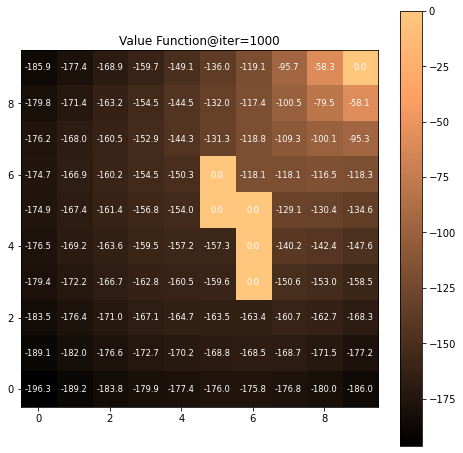
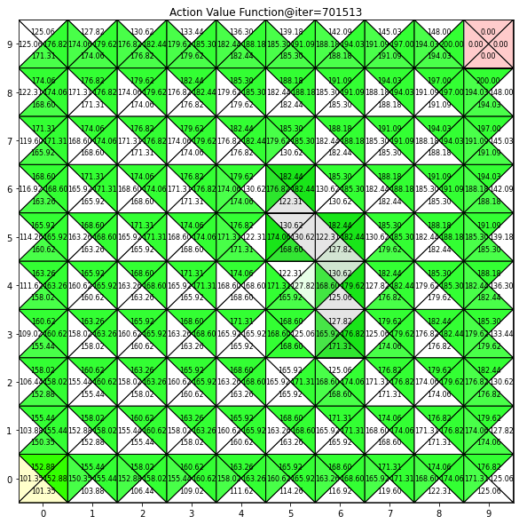
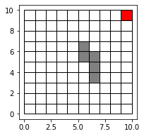

Reinforcement Learning Basics
==============

This is for basic reinforcement learning: algorithms and main equations for dynamic programming (DP), monte carlo method (MC), temporal difference (TD) and deep reinforcement learning (DRL). The task of the robot is to collect data of all sensors in the shortest possible time while it avoids any collisions to the obstacles.

Details
-----

### 0. Grid Environments

* 5x5 grid env. (grid_env_55.ipynb)   
    * Fast convergence, **recommended!!!**
* 10X10 grid env. (grid_env.ipynb)   
    * Slow convergence   

### 1. Dynamic Programming (DP)

* There are two versions of DP: state value based and action value based
* Policy evaluation, policy improvent
* Policy iteration
* Value iteration

### 2. Monte Carlo Method (MC)

* On-policy first visit MC
* Off-policy first visit MC

### 3. Temporal Difference (TD)

* SARSA, Q-learning, Expected SARSA, Double Q-learning

### 4. Deep Reinforcement Learning (DRL)
We have a robot that aims to collect data of several low-powered IoT sensors. As the sensors are low-powered, they cannot communcate over long ranges. Hence, the robot must approach each sensor to collect their data. The robot starts its mission from the start terminal. There is a charging station in the environment so that the robot can recharge its battery if it is running out of energy. Also, there are several obstacles in the environment. 

A sample result:

-----

### Value Functions (State value $V(s)$, Action value $Q(s,a)$ )

    
    

### 10x10 Grid Environment

In the following image, we have depicted the environment:

red square: starting position

green square: charging station

Black circles: IoT sensors

Blue blocks: obstacles

In this project, we define the state as a four channel image, shown below

Based on this definition, we can use CNNs to solve the MDP. 

